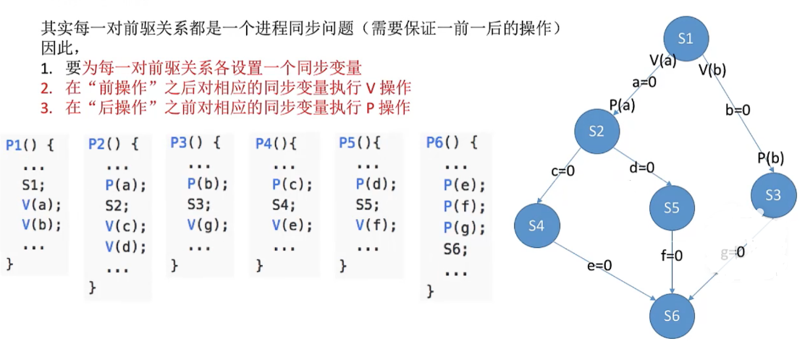

# 操作系统

## 1.1_1 操作系统的基本概念的、功能和目标

**操作系统作为用户和计算机硬件之间的接口**

- 提供的功能
    - 命令接口（联机命令接口(交互式命令接口，如CMD)|脱机命令接口，如.bat文件）
    - 程序接口
    - GUI（图形用户界面win|ios|andrio|）

- 目标
    - 方便用户使用


## 1.1_2 操作系统的特征
### **并发|并行**
**并发**：多个事件交替发生（宏观同时发生，微观交替进行）
**并行**：多个事件同时发生

### 共享
两种资源共享方式
- **互斥共享方式**：一个时间段内只允许一个进程访问该资源
- **同时共享方式**：允许一个时间段内由多个进程“同时”对它们进行访问

### 虚拟
概念：把一个物理上的实体变为若干个逻辑上的对应物
- 空分复用技术
- 时分复用技术

### 异步
概念：在多道程序环境下，允许多个程序并发执行，但由于资源有限，进程的执行不是一贯到底的，而是走走停停的，以不可预知的速度向前推进。**只有系统拥有并发性，才有可能导致异步性。**

## 1.1_3 操作系统的发展与分类
OS的发展与分类
- 手工操作阶段
    - 纸带机（用户独占全机、人机速度矛盾）
- 批处理阶段
    - 单道批处理系统（外围机-磁带）
    - 多道批处理系统（操作系统开始出现）
- 分时操作系统
    - 轮流处理作业
    - 不能处理紧急任务
- 实时操作系统
    - 优先处理紧急任务
    - 硬实时系统：必须在严格的时间内完成处理
    - 软实时系统：可以偶尔犯错
- 网络操作系统
- 分布式操作系统
- 个人计算机操作系统

## 1.1_4 操作系统的运行机制与体系结构
os的运行机制和体系结构
- 运行机制
    - 两种指令
        - 特权指令
        - 非特权指令
    - 两种处理器状态
        - 核心态（管态）
        - 用户态（目态）
        - 通过处理器中的寄存器（PSW）进行转换
    - 两种程序
        - 内核程序（运行在核心态）
        - 应用程序（运行在用户态）
- 操作系统内核
    - 时钟管理（实现计时功能）
    - 中断处理
    - 原语（程序运行具有原子性，不可中断）
    - 对系统资源进行管理的功能
        - 进程管理
        - 设备管理
        - 存储器管理
- 操作系统的体系结构
    - 大内核（将操作系统的主要功能模块都作为系统内核，运行在核心态）
    - 微内核（只把最基本的功能保留在内核）

## 1.1_5 中断和异常
- 中断机制的诞生
    - 操作系统介入，开展管理工作
    - “用户态-->核心态”是通过中断实现的。并且中断是唯一途径
- 中断的分类
    - 内中断（异常）
        - 陷阱（trap）
        - 故障（fault）
        - 中止（abort）
    - 外中断（CPU外部）
- 中断的处理过程

## 1.1_6 系统调用
概念：应用程序通过系统调用请求操作系统的服务。保证系统的稳定性和安全性。
系统调用和库函数的区别：
- 系统调用是操作系统向上层提供的接口
- 有的库函数是对系统调用的进一步封装
- 当今编写的应用程序大多是通过高级语言提供的库函数间接地进行系统调用

## 1.1_7 操作系统引导（开机过程）
操作系统引导：
1. CPU从一个特定主存地址开始，取指令，执行ROM中的引导程序（先进行硬件自检，再开机）
2. 将磁盘的第一块分区--主引导记录读入内存，执行磁盘引导程序，扫描分区表
3. 从活动分区（又称主分区，即安装了操作系统的分区）读入分区引导记录，执行其中的程序
4. 从根目录下找到完整的操作系统初始化程序（即启动管理器）并执行，完成“开机”的一系列动作


## 1.1_8虚拟机
虚拟机：使用虚拟化技术，将一台物理机器虚拟化为多台虚拟机器（Virtual Machine，VM），每个虚拟机器都可以独立运行一个操作系统
同义术语：虚拟机管理程序/虚拟机监控程序/Virtual Machine Monitor/Hypervisor


## 2.1_1 进程的定义、组成、特征

**程序**：是静态的，就是个存放在磁盘里的可执行文件，就是一系列的指令集合。
**进程（Process）**：进程是进程实体的运行过程，是系统进行资源分配和调度的一个独立单位。是动态的，是程序的一次执行过程。
当进程被创建时，操作系统会为该进程分配一个**唯一的、不重复的**“身份证号”----**PID**（Process ID，进程ID）。

- 进程的组成：
    - PCB（进程存在的唯一标志）：
        - 进程描述信息
        - 进程控制和管理信息
        - 资源分配清单
        - 处理机相关信息
    - 程序段
        - 程序的代码（指令序列）
    - 数据段
        - 运行过程中产生的各种数据（如：程序中定义的变量）

- 特征：
    - 动态性：进程的最基本的特性
    - 并发性
    - 独立性：进程是能**独立运行、独立获得资源、独立接受调度**的基本单位
    - 异步性：各进程以不可预知的速度向前推进，可能导致运行结果的不确定性
    - 结构性
**进程控制块（PCB）**：是进程存在的唯一标志，当进程被创建时，操作系统为其创建PCB，当进程结束时，会回收其PCB。


## 2.1_2 进程的状态与转换
 - 状态
    - 运行状态：占有CPU，并在CPU上运行，单核只能一个进程（双核两个）（CPU √ 其他所需资源 √）
    - 就绪状态：已经具备运行条件，但是没有空闲的CPU（CPU × 其他所需资源 √） 
    - 阻塞状态：等某个事件的发生，暂时不能运行（CPU × 其他所需资源 ×）
    - 创建状态：操作系统为新进程分配资源、创建PCB
    - 终止状态：操作系统回收进程的资源、撤销PCB
- 进程状态间的转换：
    - 就绪态-->运行态 ：进程被调度
    - 运行态-->就绪态 ：时间片到，或CPU被其他高优先级的进程抢占
    - 运行态-->阻塞态 ：等待系统资源分配，或等待某事件发生（**主动行为**）
    - 阻塞态-->就绪态 ：资源分配到位，等待的事件发生了（**被动行为**）
    - 创建态-->就绪态 ：系统完成创建进程相关的工作
    - 运行态-->终止态 ：进程运行结束，或运行过程中遇到不可修复的错误
- 进程的组织方式：链接方式：指针指向不同的队列；索引方式：索引表

## 2.1_3 进程控制
- 基本概念：进程控制就是要实现进程状态的转换，用**原语**来实现。
- 原语：用开中断和关中断来实现，原语是一种特殊的内核程序，原语的执行必须一气呵成，不可中断。
- 进程控制相关原语：
    - 进程的创建：
        - 创建原语：申请空白PCB，为新进程分配所需资源、初始化PCB，将PCB插入就绪队列。引起创建原语的事件：用户登录、作业调度、提供服务、应用请求。
    - 进程的终止：
        - 撤销原语：引起进程终止的事件：正常结束、异常结束、外界干预
    - **进程的阻塞：**
        - 阻塞原语：运行态-->阻塞态。引起进程阻塞的事件：需要等待系统分配某种资源、需要等待相互合作的其他进程完成工作。
    - **进程的唤醒：**
        - 唤醒原语：阻塞态-->就绪态。引起进程唤醒的事件：等待的事件发生。**阻塞和唤醒要成对出现**
    - 进程的切换：
        - 切换原语：运行态<-->就绪态。引起进程切换的事件：当前进程时间片到、有更高优先级的进程到达
- 无论哪个进程控制原语，要做的无非三件事情：
    1. 更新PCB中的信息（修改进程状态（state），保存/恢复运行环境）
    2. 将PCB插入合适的队列
    3. 分配/回收资源

## 2.1_4 进程通信
三种方式
- 共享存储
设置一个共享内存区域，并映射到进程的虚拟地址空间。要**互斥地**访问共享空间（由通信进程自己负责实现互斥，用P、V操作）。
两种方式：
    - 基于数据结构（低级）
    - 基于存储区的共享（高级）
- 消息传递
传递结构化的消息（消息头|消息体）。系统提供“发送|接受原语”。
两种方式：
    - 直接通信方式——消息直接挂到接受进程的消息队列里。
    - 间接（信箱）通信方式——消息先发到中间体（信箱）。
- 管道通信
    - 设置一个特殊的共享文件（管道），其实就是一个内存缓冲区
    - 一个管道只能实现半双工通信
    - 实现双向同时通信需要建立两个管道
    - 各进程要互斥访问管道（由操作系统负责实现互斥）
    - 管道写满时，写进程阻塞。管道读空时，读进程阻塞

## 2.1_5 线程
传统进程机制中，**进程是资源分配，调度的基本单位**。**引入线程后，进程是资源分配的基本单位，线程是调度的基本单位**。

### 线程的属性
 - 线程是处理机调度我基本单位
 - 多CPU计算机中，各个线程可占用不同的CPU
 - 每个线程都有一个线程ID、线程控制块（TCB）
 - 现成也有就绪、阻塞、运行三种基本状态
 - 现成几乎不拥有系统资源
 - 同一进程的不同线程间共享进程的资源
 - 由于共享内存地址空间，同一进程中的线程间通信甚至无需系统干预
 - 同一进程的线程切换，不回引起进程切换。不同进程的线程切换，会引起进程切换
 - 切换同进程内的线程，系统开销很小。切换进程，系统开销较大。

### 线程的实现方式
- 用户级线程（ULT）
    从用户视角能看到的线程，由线程库实现
- 内核级线程（KLT）
    从操作系统视角看到的线程，由操作系统实现（**内核级线程才是处理机分配的单位**）
- 组合方式
    上述两种方式的结合

### 多线程模型
- 一对一模型
    - 一个用户级线程映射到一个内核级线程
    - 优点：各个线程可分配到多核处理机并行执行，并发度高。
    - 缺点：线程管理都需要操作系统支持，开销大
- 多对一模型
    - 多个用户级线程映射到一个内核级线程
    - 优点：线程管理开销小，效率高
    - 缺点：一个线程阻塞，会导致整个进程都被阻塞（并发度低）
- 多对多模型
    - n和用户级线程映射到m个内核级线程（n>=m）
    - 集二者之所长

## 2.2_1 处理机调度的概念、层次
- 基本概念
通常进程数大于处理机数量，所以要按照一定的调度算法选择一个进程，并将处理机分配给它运行，以实现进程的并发执行。
- 三个层次
    - 高级调度（作业调度）
    按照某种规则，从后备队列中中选择合适的作业将其调入内存，并为其创建进程。
    - 中级调度（内存调度）
    按照某种规则，从挂起队列（外存中）中选择合适的进程将其数据调回内存。
    - 低级调度（进程调度）
    按照某种规则，从就绪队列中选择一个进程为其分配处理机。
- 三层调度的联系、对比
    - 高级调度
    外存-->内存（面向作业）；发生频率最低
    - 中级调度
    外存-->内存（面向进程）；发生频率中等
    - 低级调度
    内存-->CPU，发生频率最高

为减轻系统负载，提高资源利用率，暂时不执行的进程会被调到外存从而变为“挂起态”
- 七状态模型——在五状态模型的基础上加入了“就绪挂起”和“阻塞挂起”两种状态


## 2.2_2 进程调度的时机、切换与调度方式
1. 时机
    什么时候需要进程调度？
    - 主动放弃（进程正常终止、运行过程中发生异常而终止、主动阻塞）
     
    - 被动放弃（分给进程的时间片用完、有更紧急的事情需要处理、有更高优先级的进程进入就绪队列）

    什么时候不能进行进程调度？
    - 在处理中断的过程中
    - 进程在操作系统内核程序临界区中
    - 原子操作过程中（原语）

2. 切换与过程
    - 狭义的“调度”和“切换”的区别
        - 狭义：选择一个进程
        - 广义：狭义+进程切换
    - 切换过程
        - 对原先运行进程各种数据的保存
        - 对新的进程各种数据的恢复

    进程调度、切换是有代价的，并不是调度越频繁，并发度就越高。

3. 方式
    - 非剥夺调度方式（非抢占式）
    只能由当前进程主动放弃CPU

    - 剥夺调度方式（抢占式）
    可由操作系统剥夺当前进程的CPU使用权

## 2.2_3 调度算法的评价指标
1. CPU利用率
    利用率=忙碌的时间 / 总时间
2. 系统吞吐量
    总共完成了多少道作业 / 总共花了多少时间
3. 周转时间
    周转时间——作业完成时间 - 作业提交时间
    平均周转时间——各作业周转时间之和 / 作业数
    带权周转时间——作业周转时间 / 作业实际运行的时间
    平均带权周转时间——各作业带权周转时间之和 / 作业数
4. 等待时间
    进程或作业等待被服务的时间之和；平均等待时间即各个进程或作业等待时间的平均值
5. 响应时间
    从用户提交请求到首次产生响应所用的时间

## 2.2_4 调度算法1
### FCFS——先来先服务
非抢占式
优缺点：公平，实现简单；对短作业不利
不会饥饿
### SJF——短作业优先
最短的作业优先得到服务，时间相同，先到达先服务。
非抢占式（SJF）：选最短的作业先进入运行态
抢占式（SRNT）：有新作业进入就绪队列或有作业完成了，考察队列中最短作业的进程
优缺点：最短的平均等待时间和平均周转时间；对短作业有利，对长作业不利，可能产生饥饿现象
### HRRN——高响应比优先
要综合考虑作业或进程的等待时间和要求服务时间
在每次调度时先计算各个作业或进程的响应比，选择响应比最高的作业或进程为其服务
响应比=（等待时间 + 要求服务时间） / 要求服务时间
非抢占式，进程主动放弃CPU时，需要该算法选取就绪队列的作业
不会饥饿

## 2.2_5 调度算法2
### 时间片轮转算法（RR）
算法思想：公平轮流地为各个进程服务，让每个进程在一定的时间间隔内都可以得到响应。
算法规则：按照各进程到达就绪队列的顺序，轮流地让各个进程执行一次时间片（如100ms）。若进程未在一个时间片内执行完，则剥夺处理机，将进程重新放到就绪队列队尾重新排队。
只能用于进程调度，抢占式
优缺点：响应快，适用于分时操作系统；由于高频率的进程切换，因此有一定的开销；不区分任务的紧急程度。
不会饥饿
### 优先级调度算法
算法思想：根据任务的紧急程度来决定处理顺序。
算法规则：每个进程或作业有各自的优先级，调度时选择优先级最高的作业或进程。
有抢占式和非抢占式两种方式
静态优先级：不变
动态优先级：可以变
通常：系统进程优先级高于用户进程，前台进程优先级高于后台进程，操作系统更偏好I/O进程，可以从追求公平、提升资源利用率等角度考虑该表优先级。
可能会饥饿
### 多级反馈队列调度算法
算法思想：对其他算法调度的平衡
算法实现：设置多级就绪队列，各级队列优先级从高到低，时间片从小到大。新进程到达时先进入第一级队列，按照FCFS原则排队等待被分配时间片。若用完时间片进程还未结束，则进程进入下一级队列队尾。如果此时已经在最下级的队列，则重新放回最下级队列队尾。只有第k级队头的进程为空时，才会为k+1级队头的进程分配时间片。
优点：对各个进程相对公平（FCFS的优点），每个新到达的进程都可以很快就得到响应（RR的优点）；短进程只用较少的时间就可以完成（SJF）的优点；不必实现估计进程的运行时间（避免用户作假）；可灵活地调整对各类进程的偏好程度，比如CPU密集型进程、IO密集型进程。
默认抢占式
会饥饿

### 多级队列调度算法
系统中按进程类型设置多个队列，进程创建成功后插入某个队列
队列之间可采取固定优先级，或时间片划分
各队列可采用不同的调度策略，如：系统进程队列采用优先级调度，交互式队列采用RR，批处理队列采用FCFS。

## 2.3_1 进程同步、进程互斥
1. 进程同步
并发性带来了异步性。指为了完成某种任务而建立的两个或多个进程，这些进程因为需要再某些位置上协调他们的工作次序而产生的制约关系。进程间的直接制约关系就是源于它们之间的相互合作。
2. 进程互斥
把一个时间段内只允许一个进程使用的资源称为临界资源，对临界资源的互斥访问，可以在逻辑上分为四个部分：
```C++
do{
    entry section;     //进入区     对访问的资源检查或进行上锁
    critical section;  //临界区(段) 访问临界资源的那部分代码
    exit section;      //退出区     负责解锁
    remainder section; //剩余区     其它处理
} while(true)
```
需要遵循的原则：
- 空闲让进：临界区空闲时，应允许一个进程访问
- 忙则等待：临界区正在被访问时，其他试图访问的进程需要等待
- 有限等待：要在有限时间内进入临界区，保证不会饥饿
- 让权等待：进不了临界区的进程，要释放处理机，方式忙等

## 2.3_2 进程互斥的软件实现方法
### 单标志法
在进入区只做“检查”，不“上锁”。在退出区把临界区的使用权转交给另一个进程。
主要问题：不遵循“空闲让进”原则
```C++
int turn =0;
//p0进程
while(turn!=0);
critical section;
turn = 1;
remainder section;
//p1进程
while(turn!=1);
critical section;
turn = 0;
remainder section;
```

### 双标志先检查
在进入区先“检查”后“上锁”，退出去“解锁”
主要问题：不遵循“忙则等待”原则
```C++
bool flag[2]={false,false};
//p1进程
while(flag[1]);
flag[0]=true;
critical section;
flag[0]=false;
remainder section;
//p2进程
while(flag[0]);
flag[0]=true;
critical section;
flag[1]=false;
remainder section;
```
### 双标志后检查
在进入区先“上锁”后"检查"，退出区“解锁”
主要问题：不遵循“空闲让进，有限等待”原则，可能导致饥饿
```C++
bool flag[2]={false,false};
//p1进程
flag[0]=true;
while(flag[1]);
critical section;
flag[0]=false;
remainder section;
//p2进程
flag[0]=true;
while(flag[0]);
critical section;
flag[1]=false;
remainder section;
```
### Peterson算法
在进入区“主动争取-主动谦让-检查对方是否想进、己方是否谦让”
主要问题：不遵循“让权等待”原则，会发生“忙等”
```C++
bool flag[2]={false,false};
int turn=0;
//p1进程
flag[0]=true;
turn=1;
while(flag[1]&&turn==1);
critical section;
flag[0]=false;
remainder section;
//p2进程
flag[1]=true;
turn=0;
while(flag[0]&&turn==0);
critical section;
flag[1]=false;
remainder section;
```

## 2.3_3 进程互斥的硬件实现方法
### 中断屏蔽方法
使用“开/关中断”指令实现
优点：简单高效
缺点：只适用于单处理机；只适用于操作系统内核进程

### TestAndSet（TS指令/TSL指令）
TS指令是用硬件实现的，上锁、检查一气呵成
优点：实现简单；适用于多处理机环境
缺点：不满足“让权等待”，会忙等
```C++
//true表示已经上锁
bool TestAndSet(bool *lock){
    bool old;
    old=*lock;
    *lock=true;
    return old;
}

//以下是使用TSL指令实现互斥的算法逻辑
while(TestAndSet (&lock));//上锁并检查
临界区代码段
lock=false; //解锁
```

### Swap指令（XCHG指令）
别称：Exchange指令、XCHG指令
Swap指令是用硬件实现的
优点：简单；适用于多处理机
缺点：不能“让权等待”
```C++
//true表示已经上锁
void Swap(bool *a,bool *b){
    bool temp;
    temp=*a;
    *a=*b;
    *b=temp;
}

//以下是使用Swap指令实现互斥的算法逻辑
bool old=true;
while(old=true)
    Swap(&lock,&old);
临界区代码段
lock=false; //解锁
//剩余代码段
```

## 2.3_4 信号量机制
### 整型信号量
用一个整数型变量作为信号量，数值表示某种资源数
整型信号量与普通型变量的区别：对信号量只能执行初始化、P、V三种操作——wait（）、signal（），分别简称为P、V操作
整形信号量存在的问题：不满足让权等待原则
### 记录型信号量
S.value表示某种资源数，S.L指向等待该资源的队列
P操作中，一定是先S.value--，之后可能需要执行block原语
V操作中，一定是先S.value++，之后可能需要执行wakeup原语
可以用记录型信号量实现系统资源的“申请”和“释放”
可以用记录型信号量实现进程互斥、进程同步
```c++
//记录型信号量的定义
typedef struct{
    int value;
    struct process *L;
} semaphore;
//某进程需要使用资源时，通过wait原语申请
void wait (semaphore S){
    S.value--;
    if(S.value<0){
        block (S.L);//将该进程加入到消息队列中
    }
}
//进程使用完资源后，通过signal原语释放
void signal (semaphore S){
    S.value++;
    if(S.valie<=0){
        wakeup(S.L);
    }
}
```

## 2.3_5 用信号量机制实现进程互斥、同步、前驱关系
1. 实现进程互斥——互斥问题，信号量初值为1
- 分析问题，确定临界区
- 设置互斥信号量mutex，初值为1
- 临界区之前对信号量执行P操作
- 临界区之后对信号量执行V操作

2. 实现进程同步——同步问题，信号量初值为0
- 分析问题，找出哪里需要实现“一前一后”的同步关系
- 设置同步信号量，初值为0
- 在“前操作”之后执行V操作
- 在“后操作”之前执行P操作（前V后P）

3. 实现进程的前驱关系——前驱关系问题，本质上就是多级同步问题


## 2.3_6 生产者-消费者问题
只要缓冲区没满时，生产者才能把产品放入缓冲区，否则必须等待
只有缓冲区不空时，消费者才能从中取出产品，否则必须等待
缓冲区是临界资源，各个进程互斥访问
实现互斥的P操作要放在实现同步的P操作之后，否则会发生死锁
V操作不会导致进程发生阻塞的状态，所以可以交换位置
使用操作不要放在临界区，不然并发度会降低


## 2.3_7 多生产者-多消费者问题
在生产者-消费者问题中，如果缓冲区大小为1，那么有可能不需要设置互斥信号量就可以实现互斥访问缓冲区


## 2.3_8 吸烟者问题
可以理解为“生产多个产品的单生产者-多消费者”问题
“轮流让各个吸烟者吸烟”，必然需要“轮流的在桌上放上组合一、组合二、组合三”，可以用一个整型变量i实现这个轮流的过程：i = （i+1）%3


## 2.3_9 读者-写者问题
允许多个读者同时对文件执行读操作
只允许一个写者往文件中写信息
任一写者在完成写操作之前不允许其他读者或写者工作
写者执行写操作之前，应让已有的读者和写者全部退出
读者-写者问题为我们解决复杂的互斥问题提供了一个参考思路。其核心思想在于设置了一个计数器count用来记录当前正在访问共享文件的读进程数。我们可以用count的值来判断当前进入的进程是否是第一个/最后一个读进程，从而做出不同的处理。另外，对 count变量的检查和赋值不能一气呵成导致了一些错误，如果需要实现“一气呵成”，自然应该想到用互斥信号量。最后，还要认真体会我们是如何解决“写进程饥饿”问题的。
```c++
semaphore rw=1;//用于实现对文件的互斥访问。表示当前是否有进程在访问共享文件
int count=0;//记录当前有几个读进程在访问文件
semaphore mutex=1;//用于保证对count变量的互斥访问
semaphore w=1; //用于实现“写优先”
    
writer(){
    while(1){
        P（w）;
        P(rw); //写之前“加锁”
        写文件。。。
        V（rw);//写之后“解锁”
    	V(w);
    }
}

reader(){
    while(1){
        P(w);
	    P(mutex);   //各读进程互斥访问count
        if(count==0) 
            P(rw);  //第一个读进程的读进程数+1
        count++;	//访问文件的读进程数+1
        V(mutex);	
        V(w);
        读文件...
        P(mutex);	//各读进程互斥访问count
        count--;	//访问文件的读进程数-1
        if(count==0)
            V(rw);	//最后一个读进程负责“解锁”
        V(mutex);
    }
}
```

## 2.3_10 哲学家进餐问题
五个人，必须拿左右的筷子才能吃饭
避免死锁发生
解决方案： 
方案一 可以对哲学家进程施加一些限制条件，比如最多允许四个哲学家同时进餐，这样可以保证至少有一个哲学家是可以拿到左右两只筷子的。

方案二 要求奇数号哲学家先拿左边的筷子，然后再拿右边的筷子，而偶数号哲学家刚好相反。用这种方法可以保证如果相邻的两个奇偶号哲学家都想吃饭，那么只会有其中一个可以拿起第一只筷子，另一个会直接阻塞。这就避免了占有一只后再等待另一只的情况。

方案三 仅当一个哲学家左右两只筷子都可用时才允许他抓起筷子。
```c++
semaphore chopstick[5]={1,1,1,1,1};
semaphore mutex = 1;  //互斥地取筷子
Pi(){				 //i号哲学家的进程
    while(1){
        P(mutex);
        p(chopstick[i]);      //拿右
        p(chopstick[(i+1)%5]);//拿左
        V(mutex);
        吃饭...
        V(chopstick[i]);
        V(chopstick[(i+1)%5]);
        思考...
    }
}
```

## 2.3_11 管程
- 为什么要引入管程？
解决信号量机制编程麻烦、易出错的问题
- 组成
    - 共享数据结构
    - 对数据结构初始化的语句
    - 一组用来访问数据结构的过程（函数）
- 基本特征
    - 各外部进程/线程只能通过管程提供的特定“入口”才能访问共享数据
    - 每次仅允许一个进程在管程内执行某个内部过程
相当于面向对象中的类，管程是将数据放在private中，函数放在public中

拓展1：用管程解决生产者消费者问题
```c++
monitor producerconsumer
    condition full,empty;
    int count = 0;
    void insert(Item item){
        if(count == N)
            wait(full);
        count++;
        insert_item (item);
        if(count == 1)
            signal(empty);
    }
    Item remove(){
        if(count == 0)
            wait(empty);
        count--;
        if(count == N-1)
            signal(full);
        return remove_item();
    }
    end monitor;

//使用
producer(){
    while(1){
        item = 生产一个产品;
        producerconsumer.insert(item);
    }
}

consumer(){
    while(1){
        item = producerconsumer.remove();
        消费产品 item;
    }
}
```
拓展2：Java中类似于管程的机制
java中用synchronized来描述一个函数,这个函数同一时间只能被一个线程调用

## 2.4_1 死锁的概念